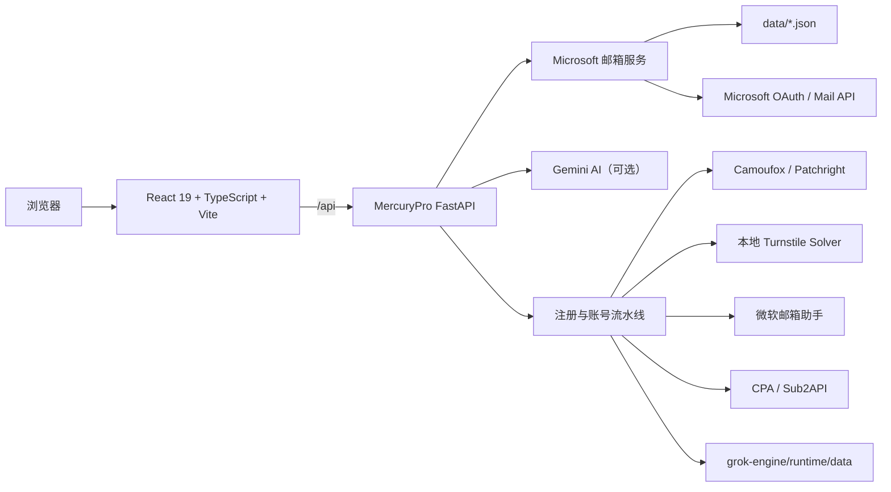

<p align="center">
  
</p>

<h1 align="center">MercuryPro</h1>

<p align="center">
  可独立部署、面向扩展的邮箱管理与账号自动化工作台
</p>

<p align="center">
  
  
  
  
  
</p>

MercuryPro 是一个以 Microsoft Outlook 邮箱管理为基础、内置 Grok（xAI）注册工作流的个人工作台。项目采用 React + TypeScript 前端和统一 FastAPI + Python 后端，Node.js 仅用于前端开发与构建，不承载后端业务接口。

项目按照模块化工作台设计，当前聚焦邮箱与注册能力，后续可继续扩展日历、联系人、统计、工单、AI 助手以及其他账号平台。

> [!IMPORTANT]
> MercuryPro 仍在持续开发。邮箱管理与 Grok 注册中心是当前主要可用模块；日历、联系人、数据统计、工单和部分 AI 交互目前属于扩展界面或预留能力，不能视为完整生产功能。

## 功能状态

| 模块 | 状态 | 说明 |
| --- | --- | --- |
| Outlook 邮箱账户管理 | 可用 | 导入、分页、筛选、状态管理、Token 刷新、删除与数据导出 |
| 邮件列表与正文 | 可用 | 获取邮件列表、查看纯文本或 HTML 正文、隔离渲染邮件内容 |
| Grok 注册中心 | 可用 | 注册配置、邮箱池、代理、并发建议、注册监控与中文日志 |
| 微软邮箱账户池 | 可用 | 邮箱测活、3 槽位别名使用、优先选择、恢复和删除 |
| 注册后自动处理 | 可用 | 凭据转换、导入前测活、导入 CPA 或 Sub2API、绑定分组 |
| 账号轮询台账 | 可用 | 搜索、分页、单个/批量探活、定时轮询和本地记录管理 |
| 主题与公共交互 | 可用 | 多套亮/暗主题、极客深色主题、统一确认弹框和动效 |
| Gemini 邮件助手 | 可选/实验性 | 后端已提供摘要、回复和自动标签接口，需要 API Key |
| OpenAI 注册适配器 | 预留 | 后端保留适配代码，当前工作台未开放注册入口 |
| 日历、联系人、统计、工单 | 规划中 | 当前主要用于展示未来工作台的扩展方向 |

## 核心能力

### 邮箱管理

- 服务端分页，并支持邮箱、使用状态筛选。
- 通过文本或 TXT 文件批量导入 Microsoft 邮箱账号。
- 自动校验导入格式并跳过重复邮箱。
- 修改账号状态、删除账号、复制 JSON 和导出原始配置。
- 使用 Refresh Token 换取 Microsoft Access Token。
- 获取真实邮件列表与完整正文；HTML 邮件在沙箱 iframe 中隔离显示。
- 邮箱账户持久化至项目数据目录。

### Grok 注册中心

- 在 MercuryPro 内部运行注册引擎，无需连接或启动其他项目。
- 支持自定义邮箱 API 和本地微软邮箱账户池。
- 一个微软邮箱默认提供 3 个注册槽位：原始地址、`+1`、`+2`。
- 支持代理轮询、随机和固定策略。
- 根据服务器 CPU、内存和 Solver 状态提供推荐最大并发数，但不强制限制用户设置。
- 支持批次暂停、恢复、停止、重试以及实时流程监控。
- 注册日志采用中文语义和成功、警告、失败状态色。
- 注册成功后可自动测活并导入 CPA 或 Sub2API。

### 可扩展工作台

- 导航、页面模块、API 客户端和后端路由彼此分离。
- 新业务可作为独立模块接入，不需要改写邮箱或注册核心逻辑。
- 主题由统一预设驱动，新模块可直接复用现有颜色系统。
- 公共确认框、下拉框、状态提示等交互组件可复用。

## 系统架构



### 技术栈

| 层级 | 技术 |
| --- | --- |
| 前端 | React 19、TypeScript 5.8、Vite 6、Tailwind CSS 4 |
| UI 与动效 | Motion、Lucide React、主题预设系统 |
| 后端 | Python、FastAPI、Uvicorn、Pydantic |
| 网络访问 | HTTPX、Requests、curl_cffi |
| 浏览器自动化 | Camoufox、Patchright |
| 本地辅助服务 | Turnstile Solver、微软邮箱助手 |
| 数据存储 | JSON 文件（当前单机实现） |
| 部署 | 本地脚本、Docker、Docker Compose |

## 快速开始

### 环境要求

- Windows 10/11（本地一键安装流程的主要支持平台）
- Node.js 22 或更高版本
- Python 3.10 或更高版本
- npm
- 首次安装需要联网下载 Python 依赖和 Camoufox 浏览器运行时

> [!NOTE]
> 其他操作系统建议优先使用 Docker。本地 `setup:grok` 当前使用 PowerShell 和 Windows 虚拟环境路径。

### Windows 一键启动

双击项目根目录中的：

```text
start-mercurypro.bat
```

脚本会自动创建 `.env`、安装前端依赖、准备 Python 虚拟环境、下载 Camoufox，并打开：

```text
http://localhost:3000
```

### 手动启动开发环境

```powershell
Copy-Item .env.example .env
npm install
npm run setup:grok
npm run dev
```

`npm run dev` 会同时运行：

- Vite 前端：`http://127.0.0.1:3000`
- FastAPI 后端：`http://127.0.0.1:39181`

Vite 会把 `/api` 请求代理到 FastAPI。按 `Ctrl + C` 可停止开发服务。

### 单独运行

```bash
# 仅启动 Vite 前端
npm run dev:web

# 启动 FastAPI；如 dist 已构建，会同时提供生产前端
npm run backend
```

## 邮箱导入格式

邮箱管理使用以下格式，每行一个账号：

```text
email@example.com----x----refresh_token----client_id
```

字段含义：

| 字段 | 说明 |
| --- | --- |
| `email@example.com` | Microsoft 邮箱地址 |
| `x` | 固定占位分隔符 |
| `refresh_token` | Microsoft OAuth Refresh Token |
| `client_id` | 对应的 OAuth Client ID |

导入前请确认账号数据来源合法，并妥善保存 Token。

## 环境变量

复制 `.env.example` 为 `.env` 后按需修改：

| 变量 | 默认值 | 用途 |
| --- | --- | --- |
| `HOST` | `0.0.0.0` | FastAPI 监听地址 |
| `PORT` | `3000` | 独立启动时的服务端口；开发联合模式使用 `GROK_ENGINE_PORT` |
| `APP_URL` | `http://127.0.0.1:9100` | 部署后的应用地址或回调基础地址 |
| `DATA_DIR` | `./data` | Microsoft 邮箱账户数据目录 |
| `MICROSOFT_TOKEN_URL` | Microsoft Consumers OAuth 地址 | Token 刷新端点 |
| `MICROSOFT_MAIL_API_BASE_URL` | Outlook Mail API 地址 | 邮件接口根地址，可按需要覆盖 |
| `GEMINI_API_KEY` | 空 | 启用 Gemini 邮件摘要、回复与自动标签 |
| `GEMINI_MODEL` | `gemini-3.6-flash` | 可选，覆盖 Gemini 模型名称 |
| `GROK_ENGINE_PYTHON` | 自动检测 | 可选，指定注册引擎 Python |
| `GROK_SOLVER_PYTHON` | 自动检测 | 可选，指定 Solver Python |
| `GROK_MAIL_HELPER_PYTHON` | 自动检测 | 可选，指定邮箱助手 Python |
| `GROK_ENGINE_PORT` | `39181` | 联合开发模式的 FastAPI 端口 |
| `GROK_SOLVER_PORT` | `39182` | 本地 Turnstile Solver 首选端口 |
| `GROK_MAIL_HELPER_PORT` | `39183` | 微软邮箱助手首选端口；占用时会自动寻找可用端口 |

## Docker 部署

```bash
docker compose up --build -d
```

默认访问：

```text
http://127.0.0.1:9100
```

健康检查：

```text
GET http://127.0.0.1:9100/api/health
```

### 查看 Linux 容器中的注册浏览器

容器内置 Xvfb + noVNC 调试桌面，默认不启动。需要调试时先在 `.env` 设置：

```env
BROWSER_DEBUG_DESKTOP_ENABLED=true
```

然后执行 `docker compose up -d --force-recreate`，并在注册配置中打开
“显示注册浏览器”。noVNC 只绑定服务器本机 `127.0.0.1:6080`，在自己的电脑建立 SSH 隧道：

```bash
ssh -L 6080:127.0.0.1:6080 用户名@服务器地址
```

保持 SSH 连接，再打开：

```text
http://127.0.0.1:6080/vnc.html?autoconnect=true&resize=scale
```

即可实时查看 Camoufox 的页面填写、点击和报错画面。该桌面没有额外登录验证，
不要把 `6080` 端口直接绑定到公网；如需修改本机端口，可在 `.env` 设置
`NOVNC_HOST_PORT`。

调试结束后关闭“显示注册浏览器”，再把 `.env` 改回：

```env
BROWSER_DEBUG_DESKTOP_ENABLED=false
```

执行 `docker compose up -d --force-recreate` 后，Xvfb、x11vnc 和 noVNC 均不会启动。

停止服务：

```bash
docker compose down
```

Compose 默认将 `./data` 挂载到容器的 `/app/data`。如果需要长期保留 Grok 注册历史、邮箱池和轮询台账，请额外挂载以下目录，并避免挂载整个 `grok-engine/runtime` 以免覆盖镜像中的 Python 环境：

```yaml
volumes:
  - ./data:/app/data
  - ./grok-engine/runtime/data:/app/grok-engine/runtime/data
  - ./grok-engine/config:/app/grok-engine/config
```

## 常用命令

| 命令 | 说明 |
| --- | --- |
| `npm run dev` | 同时启动 FastAPI 和 Vite |
| `npm run dev:web` | 仅启动 Vite 开发服务器 |
| `npm run backend` | 启动统一 FastAPI 服务 |
| `npm run setup:grok` | 创建 Python 环境并安装注册引擎依赖 |
| `npm run lint` | 执行 TypeScript 类型检查 |
| `npm run build` | 构建生产前端到 `dist/` |
| `npm run start` | 启动生产 FastAPI 服务 |
| `npm run preview` | 预览 Vite 构建结果 |
| `npm run clean` | 清理前端构建目录 |

## 项目目录

```text
MercuryPro/
├─ src/
│  ├─ api/                    # 前端 API 客户端
│  ├─ components/             # 工作台页面与公共组件
│  ├─ data/                   # 主题预设和界面初始数据
│  ├─ App.tsx                 # 应用入口与模块调度
│  └─ types.ts                # 公共 TypeScript 类型
├─ grok-engine/
│  ├─ backend/                # 统一 FastAPI、邮箱、AI 与注册业务
│  ├─ tools/                  # 微软邮箱助手等本地工具
│  ├─ vendor/                 # 浏览器注册与 Solver 子模块
│  ├─ config/                 # 运行配置（敏感文件默认忽略）
│  └─ runtime/                # Python 环境和运行数据（默认忽略）
├─ scripts/                   # 开发、生产启动与环境安装脚本
├─ data/                      # Microsoft 邮箱账户持久化目录
├─ public/                    # 前端静态资源
├─ Dockerfile
├─ docker-compose.yml
└─ package.json
```

## API 边界

主要接口按业务域划分：

| 前缀 | 说明 |
| --- | --- |
| `/api/health` | 服务与注册适配器状态 |
| `/api/microsoft/*` | Microsoft 邮箱账户、Token 和邮件正文 |
| `/api/grok/*` | MercuryPro 对外使用的 Grok 注册接口前缀 |
| `/api/ai/*` | 可选 AI 邮件处理接口 |

FastAPI 内部会把 `/api/grok/*` 映射到统一注册引擎路由，因此前端无需知道辅助进程的实际端口。

## 如何扩展

### 新增前端工作台模块

1. 在 `src/types.ts` 的 `NavTab` 中增加模块标识。
2. 在 `WorkbenchSidebarNav.tsx` 添加导航入口。
3. 在 `ExtensionModules.tsx` 接入独立页面组件。
4. 将接口请求封装到 `src/api/<module>.ts`，不要在页面中散落请求地址。
5. 复用 `StylePreset`、公共弹框和现有状态色，保证不同主题下表现一致。

### 新增后端业务域

1. 在 `grok-engine/backend/` 新建独立模块。
2. 使用 `APIRouter(prefix="/api/<module>")` 管理路由。
3. 在 `grok-engine/backend/app.py` 注册 Router。
4. 将外部 API、业务逻辑和持久化拆分，避免继续扩大单个路由文件。
5. 为可选服务提供健康状态和明确的降级行为。

### 扩展数据存储

当前 JSON 持久化适合单机使用。接入 SQLite、PostgreSQL 或其他数据库时，建议保留现有 API 响应结构，并在后端增加 Repository/Service 层，使前端无需随存储方式变化。

### 新增主题

在 `src/data/stylePresets.ts` 中追加一个 `StylePreset` 即可。主题会自动出现在右上角风格选择器中，并持久化到浏览器本地存储。

## 路线图

- [x] Microsoft 邮箱账号导入与管理
- [x] Token 刷新、邮件列表和 HTML 正文查看
- [x] 独立 FastAPI 后端，移除 Node.js 业务后端
- [x] Grok 注册、邮箱池、代理与自动导入
- [x] 注册监控、中文日志与账号轮询台账
- [x] 多主题和公共交互组件
- [ ] 完善 AI 邮件分类、摘要和快捷回复交互
- [ ] 将日历、联系人、统计与工单模块接入真实后端
- [ ] 可插拔数据库与数据迁移工具
- [ ] 用户认证、权限控制和多用户隔离
- [ ] 自动化测试、发布版本与升级文档
- [ ] 插件化模块注册机制

## 数据与安全

- `.env`、邮箱 Token、注册凭据和运行时数据均属于敏感信息。
- 不要提交 `data/*.json`、`grok-engine/runtime/` 或 `grok-engine/config/config.json`。
- 建议仅监听可信网络；对公网部署前应增加 HTTPS、身份认证、访问控制和速率限制。
- HTML 邮件使用沙箱 iframe 展示，但仍应把邮件内容视为不可信输入。
- 请仅管理本人拥有或已获授权的邮箱与账号，并遵守 Microsoft、xAI、CPA、Sub2API 及相关服务的条款和当地法律。
- 本项目不应被用于垃圾注册、绕过平台限制、批量滥用或任何未经授权的行为。

## 参与开发

欢迎通过 Issue 或 Pull Request 提交问题和改进。建议在提交前完成：

```bash
npm run lint
npm run build
```

新增功能时请同时更新 README 中的功能状态、环境变量、目录说明或路线图，确保文档与实现保持一致。

---

<p align="center">
  MercuryPro · Build a calmer, extensible personal workspace.
</p>
